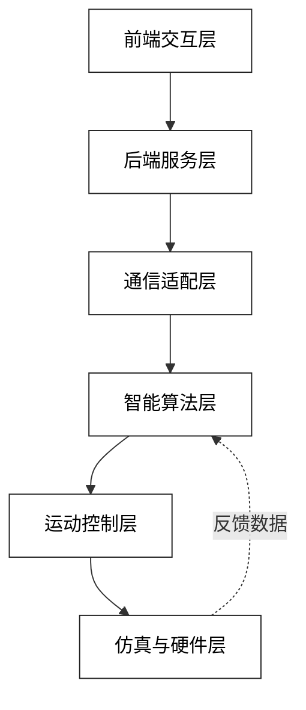

[README.md](https://github.com/user-attachments/files/30147174/README.md)<p align="center">
  
</p>
<h1 align="center"><em>VisRLFlexGrasp</em></h1>
<p align="center"><strong>基于视觉感知与强化学习的自适应柔性抓取果蔬分拣系统</strong></p>
<p align="center">(放图片)</p>


<p align="center">
  <a href="https://再说吧hh">官网</a> &nbsp;&middot;&nbsp;
  <a href="https://hhh">文档</a> &nbsp;&middot;&nbsp;
  <a href="#-核心功能">核心功能</a> &nbsp;&middot;&nbsp;
  <a href="#-项目创新点">项目创新点</a> &nbsp;&middot;&nbsp;
  <a href="#-应用场景">应用场景</a> &nbsp;&middot;&nbsp;
  <a href="#-Demo">Demo</a> &nbsp;&middot;&nbsp;
  <a href="#-技术栈说明">技术栈说明</a> &nbsp;&middot;&nbsp;
  <a href="#-快速开始">快速开始</a> &nbsp;&middot;&nbsp;
  <a href="#-系统整体设计">系统整体设计</a> &nbsp;&middot;&nbsp;
  <a href="#-环境部署">环境部署</a>
</p>


---

生鲜果蔬分拣是采后处理的核心环节，当前作业模式大多依靠人工，不仅招工成本高、分拣效率有限，人工操作与传统刚性机械臂极易造成果蔬破损。市面上常规自动化设备均采用固化控制逻辑，难以适配生鲜产品品类多变的生产场景。针对该类实际工程问题，本项目提出一套视觉 - 策略 - 执行闭环分拣解决方案。


***VisRLFlexGrasp***是一款基于**视觉感知**与**强化学习**的**自适应柔性抓取果蔬分拣**系统。针对生鲜果蔬**形态不均、质地易损、分拣损耗高**的痛点，融合**视觉识别、强化学习决策与柔性力控技术**，实现无序场景下果蔬的**无损识别、自适应抓取与自动化分拣**。依托仿真平台完成全流程验证，可**适配多品类果蔬分拣需求**，为生鲜产后处理自动化提供可复用的技术方案。


## ✨核心功能

<div align="center">
<table align="center" width="94%" style="width:94%; margin-left:auto; margin-right:auto;">
  <tr>
    <td align="center" width="50%" valign="top">
      <br>
      <h3>HHHHHHHHHH</h3>
      <div align="left">
        • HHHHHHHHHH<br>
        • HHHHHHHHHH<br>
        • HHHHHHHHHH
      </div>
    </td>
    <td align="center" width="50%" valign="top">
      <br>
      <h3>HHHHHHHHHH</h3>
      <div align="left">
        •HHHHHHHHHH<br>
        •HHHHHHHHHH<br>
        •HHHHHHHHHH
      </div>
    </td>
  </tr>
  <tr>
    <td align="center" width="50%" valign="top">
      <br>
      <h3>HHHHHHHHHH</h3>
      <div align="left">
        •HHHHHHHHHH<br>
        •HHHHHHHHHH<br>
        •HHHHHHHHHH
      </div>
    </td>
    <td align="center" width="50%" valign="top">
      <br>
      <h3>HHHHHHHHHH</h3>
      <div align="left">
        • HHHHHHHHHH<br>
        • HHHHHHHHHH<br>
        • HHHHHHHHHH
      </div>
    </td>
  </tr>
</table>
</div>


## 💡项目创新点

**再说吧🤣🤣🤣~~**

## 🦾应用场景

本系统面向生鲜自动化分拣与算法研发领域，主要应用场景包括：

* **果蔬自动化分拣流水线仿真测试**

* **柔性机械臂力控抓取算法验证**

* **无序堆叠生鲜无损分拣作业模拟**

* **农产品自动化处理方案研发与教学实训**

同时可拓展至其他易损农产品及柔性抓取相关自动化场景。

<p align="center">(放图片)</p>


## 🎬 Demo

<div align="center">
<table>
<tr>
<td width="50%">
HHHHHHHHHHHHHHHHHHHHHHHHHHH这里放视频HHHHHHHHHHHHHHHHHHHHHHHHH
</td>
<td width="50%">
HHHHHHHHHHHHHHHHHHHHHHHHHHH这里放视频HHHHHHHHHHHHHHHHHHHHHHHHH
</td>
</tr>
<tr>
<td colspan="2" align="center"><sub>HHHHHHHHHH</sub></td>
</tr>
</table>
</div>


## 💻技术栈说明

本系统采用**分层解耦的全链路模块化技术架构**，围绕**[视觉感知 - 决策规划 - 运动执行 - 交互监控]**完整流水线选型，兼顾控制实时性、算法迭代效率与工程可维护性，支撑从仿真验证到实物部署的平滑迁移。

- **嵌入式控制层**：基于 C++17 高性能开发，采用 CMake 标准化构建，依托 CoppeliaSim 搭建机械臂仿真闭环，核心实现机械臂运动规划、柔性力控算法与抓取执行逻辑，保障控制时延与运动精度。

- **智能算法层**：以 Python 3.9 为算法开发基座，融合 OpenCV 视觉处理能力与深度强化学习框架，完成果蔬目标检测、位姿解算，以及自适应柔性抓取策略的训练与推理，实现非结构化场景下的分拣决策。

- **通信调度层**：采用 TCP Socket 实现低延迟跨模块通信，基于标准化 JSON 协议完成数据交互，配套持久化存储与全链路日志体系，承担多模块数据转发、异常监控与任务调度功能。

- **可视化交互层**：构建 Web 端人机交互面板，实现分拣状态实时可视化、运行参数在线配置与历史数据回溯，支撑系统调试与运行态监控。

- **工程化体系**：基于 Git + GitHub 实现版本协同，配套规范化目录结构、分支管理与代码审核流程，保障多人并行开发的工程一致性


## 🚀快速开始

本章节完整覆盖环境校验、源码部署、模块编译、服务启动、任务测试、硬件实物部署全部流程。本项目分为纯仿真运行模式与实体硬件部署模式，两套模式架构完全一致，无需修改代码即可无缝切换。

### 🎬 整体效果演示

（放视频）


###  📌 版本兼容性说明


### 💻 硬件配置要求

仿真最低配置：

实物部署配置：

---
### ✅完整步骤

* 第一步：获取项目源码与结构校验

（放代码）

* 第二步：环境搭建与安装

（放代码）

* 第三步：全局配置文件说明

项目所有端口、参数、模型路径全部统一在XXXXXXXXX，所有模块共用一套配置，不需要多处修改参数。

（放代码）

只修改enable_hardware这一个参数，就可以一键切换仿真 / 实物两套运行环境。

* 第四步：仿真模式分步启动

* 第五步：实物硬件部署模式

* 第六步：执行分拣任务与操作演示
* 第七步：单模块独立自测
* 第八步：开发调试一键启动
* 第九步：完整故障排查体系
* 如需查阅详细规范与教程：[STYLEGUIDE](./docs/STYLEGUIDE)


## 系统整体设计
### 🧩分层架构设计

1. 架构总览
本项目采用**六层递进式分层架构**，遵循「高内聚、低耦合」的设计原则，自上而下分为前端交互层、后端服务层、通信适配层、智能算法层、运动控制层、仿真与硬件层。各层职责单一，仅通过标准化接口与相邻层交互，支持模块独立迭代与跨语言协同开发。


2. 各层职责

| 层级         | 核心职责                                     | 关键模块                                               | 技术栈                                  |
| ------------ | -------------------------------------------- | ------------------------------------------------------ | --------------------------------------- |
| 前端交互层   | 可视化交互、任务下发、状态监控、参数配置     | 任务控制面板、实时画面预览、分拣统计看板、参数配置页   | Vue3 / ECharts / WebSocket              |
| 后端服务层   | 业务逻辑编排、任务调度、状态管理、数据持久化 | 任务调度模块、设备管理模块、数据存储模块、RESTful API  | Python3.9 / FastAPI / SQLite            |
| 通信适配层   | 跨层数据转发、协议封装解析、连接状态维护     | TCP 服务端、数据序列化模块、心跳保活机制               | Socket / JSON 自定义协议                |
| 智能算法层   | 视觉感知、目标检测、位姿估计、抓取策略生成   | 果蔬检测模型、位姿估计算法、柔性抓取规划、RL 策略推理  | Python3.9 / OpenCV / PyTorch            |
| 运动控制层   | 机械臂运动解算、轨迹规划、执行指令下发       | 运动学解算模块、轨迹插补模块、IO 控制模块              | C++17 / 机械臂 SDK                      |
| 仿真与硬件层 | 物理仿真环境、实体硬件执行、传感器数据采集   | CoppeliaSim 仿真场景、柔性夹爪、深度相机、嵌入式控制器 | CoppeliaSim / 嵌入式固件 / 深度相机驱动 |

3. 层间通信机制
  单向依赖原则：上层通过标准化接口调用下层能力，下层通过回调 / 事件通知向上层反馈状态，严格禁止跨层直接调用。
    跨语言通信：算法层（Python）与控制层（C++）通过 TCP Socket 实现数据传输，采用自定义 JSON 协议封装指令与状态数据，兼顾跨语言兼容性与传输效率。
    前后端通信：前端与后端通过 RESTful API 完成任务提交与数据查询，通过 WebSocket 推送实时设备状态与分拣进度。
4. 核心业务流转（分拣全流程）
  用户在前端交互层下发分拣任务，配置分拣品类、速度等参数
    后端服务层接收任务，完成参数校验、资源调度与任务入库
    后端通过通信适配层向智能算法层下发图像采集指令
    智能算法层调用仿真 / 硬件层的深度相机获取画面，完成果蔬检测与最优抓取位姿计算
    算法层将抓取位姿数据通过通信层下发至运动控制层
    运动控制层完成运动学解算与轨迹插补，驱动仿真 / 硬件层的机械臂执行抓取、分拣、放置动作
    执行结果与设备状态逐层向上回传，前端实时更新任务进度与分拣统计数据
5. 架构设计优势
  解耦性强：各层职责边界清晰，替换硬件、迭代算法、重构前端均不影响其他层级代码
    扩展性好：可在对应层级快速新增分拣品类、算法模型、设备类型，无需改动整体架构
    调试友好：支持仿真环境与实体硬件无缝切换，可按层定位问题，降低调试成本
    协同高效：前后端、算法、嵌入式团队可基于接口约定并行开发，互不阻塞
<details> 
<summary>点击查看 异常降级设计</summary>
硬件异常：运动控制层实时捕获故障信号，逐层上报并触发紧急停止逻辑，保障设备安全；<br>
算法超时：设置推理超时阈值，超时后自动降级至几何默认抓取策略，保证任务不中断；<br>
通信中断：心跳检测机制自动触发重连，任务状态持久化存储，连接恢复后自动接续执行；<br>
</details>


### ▶️项目运行流程

* **启动流程（按依赖顺序）**

1. 仿真/硬件初始化：启动 CoppeliaSim 加载机械臂分拣场景，完成硬件接口与环境自检。 

2. 调度服务启动：开启 TCP 通信调度服务，启动端口监听与数据转发引擎，初始化日志与存储模块。

3. 控制层接入：启动 C++ 机械臂控制程序，建立仿真/硬件驱动连接，接入调度服务完成状态同步。

4. 算法层接入：启动 Python 算法服务，加载视觉检测与强化学习模型权重，接入调度服务并完成推理预热。

5. 交互层接入：启动前端可视化页面，与调度服务建立连接，同步全量系统状态，进入运行就绪态。

* **业务运行链路**

1. 视觉模块采集场景图像，完成果蔬目标检测与位姿解算，将感知数据上报调度服务。

2. 调度服务转发感知数据至强化学习决策模块，输出最优抓取轨迹与柔性力控参数。

3. 调度服务向控制层下发运动指令，驱动机械臂完成精准抓取与分类投放。

4. 控制层实时回传运动状态与力控数据，调度服务同步更新全链路状态至前端。

5. 前端可视化展示分拣进度、设备运行数据与统计结果，支持运行参数在线调优。

### 📁仓库目录结构
```text
**VisRLFlexGrasp/
├── frontend/                                  # 前端交互层：UI界面、可视化、交互逻辑
│   ├── src/
│   │   ├── api/                                   # 前端接口请求
│   │   ├── components/                 # 公共UI组件
│   │   ├── views/                              # 页面视图
│   │   ├── router/                             # 路由管理
│   │   ├── assets/                             # 静态资源
│   │   └── utils/                                 # 前端工具函数
│   ├── public/                                   # 静态入口资源
│   └── config/                                   # 项目构建与依赖配置
├── backend/                                    # 后端调度层：接口服务、业务调度、中间件
│   ├── app/
│   │   ├── api/                                    # 接口路由
│   │   ├── service/                            # 业务逻辑
│   │   ├── model/                              # 数据模型
│   │   ├── schema/                           # 数据校验规则
│   │   └── middleware/                   # 中间件（日志、权限等）
│   ├── config/                                    # 全局配置
│   ├── comm/                                    # 通信模块
│   └── main/                                      # 项目入口与依赖声明
├── algorithm/                                  # 算法核心层：视觉识别+强化学习决策
│   ├── vision/                                    # 视觉检测、分类模块
│   ├── rl/                                             # 强化学习算法与训练
│   ├── inference/                              # 模型推理
│   ├── datasets/                                # 数据集与预处理
│   └── common/                                # 算法公共工具
├── embedded/                                  # 嵌入式C++控制层：机械臂控制、通信、驱动
│   ├── drivers/                                    # 硬件驱动
│   ├── motion/                                    # 运动与抓取控制
│   ├── comm/                                      # 模块间通信
│   ├── common/        			 # 通用工具
│   ├── platform/       			  # 平台适配
│   └── cmake/                  		   # 编译配置文件
├── database/            			  # 数据层：数据表、备份、初始化脚本
│   ├── schema/         			   # 库表结构
│   ├── migrations/                              # 版本迁移
│   ├── scripts/                                      # 操作脚本
│   ├── backup/                                     # 数据备份
│   └── init_data/                                  # 初始化数据
├── common/                                        # 跨模块公共组件：工具类、协议、通用逻辑
├── docs/                                                # 项目文档：部署指南、开发规范、说明文档
├── deploy/                                            # 部署脚本：一键部署、启动、环境配置
└── tests/                                                # 测试用例：单元测试、集成测试、全链路验证**
```


## 项目开发统一规范
### 🔗通信接口规范
* 模块间采用 TCP Socket 长连接通信，基于标准化 JSON 报文格式完成数据交互，统一定义请求 / 响应字段、业务状态码与数据帧结构，保障跨模块数据传输的一致性、可扩展性与低时延。


### 💻 源代码编写规范
* 代码中避免固定数值与路径直接写死，按模块分层实现业务解耦，统一变量、函数书写形式，保证代码可读性与后期可维护性。


### 📁 文件目录命名规范
* 所有文件与文件夹全部采用小写横杠命名法，文件必须放置在指定层级，禁止随意新建目录，保证工程结构统一。


### 🌿Git开发规范
* 采用功能分支协作流程，统一分支命名规则、提交信息格式与 PR 代码合并审核机制，明确功能开发、问题修复、版本发布的分支管理路径，保障多人并行开发的工程一致性与代码可追溯性。


### 📄 项目文档撰写规范
* 所有说明文档标题层级统一，表述客观精简，一份文档只描述一项内容，代码迭代修改时必须同步更新对应文档。

 

完整字段定义、接口清单与通信流程约定;本节规定项目代码统一书写要求，完整细则;完整存放规则与禁用要求;完整分支策略、提交规范与协作流程;完整排版、用词、配图书写标准，详见：[STYLEGUIDE](./docs/STYLEGUIDE)


## ⚙️环境部署

* 本项目全模块运行环境清单：

1. 仿真端：CoppeliaSim

2. 嵌入式开发：VS2022 + C++17标准

3. 算法模块：Python3.9 + 视觉检测、强化学习依赖库

4. 后端服务：轻量数据库 + TCP通信数据交互组件

5. 协作工具：Git + GitHub 代码仓库管理工具

* **完整安装、配置、启动操作见[env_install](./docs/env_install)。**


## 👥团队分工

**1.项目负责人**
* 姓名：钱麟
* 整体架构设计，制定项目全套开发规范；编写柔性抓取、力控相关 C++ 核心代码；统筹所有文档与答辩材料。

**2.算法开发**

* 姓名：王玥琦
* 完成果蔬视觉识别、数据集处理，搭建强化学习训练、推理模块，输出抓取决策参数。

**3.后端通信开发**

* 姓名：赵星辉
* 搭建 TCP 跨模块调度服务，设计数据库与日志系统；Git 仓库日常管理、分支维护。

**4.嵌入式开发**

* 姓名：陈晓楠
* 硬件驱动适配、机械臂运动执行逻辑、仿真通信调试。

**5.前端可视化开发**

* 姓名：XXX

* XXXXXXXXXXXXXXXXXXXXXXXXXXXXXXXXXXXXXXXXXXXXXXXXXXXXXXXXXXXXXXXXXXXXXXXXXXXXXXXXXXXXXXXXXX

<p align="center">(均变更)</p>

<details>
<summary><b>点击展开查看完整分工明细</b></summary>
<table align="center" width="100%">
<tr>
<th width="15%">角色</th>
<th width="10%">姓名</th>
<th width="16%">GitHub主页</th>
<th width="59%">核心工作职责</th>
</tr>
<tr>
<td>项目负责人</td>
<td>钱麟</td>
<td><a href="https://github.com/WAGVN">WAGVN</a></td>
<td>统筹整体软件架构、仓库目录规范；编写机械臂驱动、柔性力控、抓取规划C++代码；整合全部项目文档</td>
</tr>
<tr>
<td>算法开发</td>
<td>王玥琦</td>
<td><a href="https://github.com/chunkun-end">chunkun-end</a></td>
<td>果蔬目标检测、图像定位、数据集预处理，输出目标坐标</td>
</tr>
<tr>
<td>后端通信开发</td>
<td>赵星辉</td>
<td><a href="https://github.com/zhuge-Tom">zhuge-Tom</a></td>
<td>TCP服务调度、数据库设计、多模块数据转发、异常日志处理</td>
</tr>
<tr>
<td>嵌入式开发</td>
<td>陈晓楠</td>
<td><a href="https://github.com/chenxiaonan123">chenxiaonan123</a></td>
<td>硬件驱动适配、机械臂运动执行逻辑、仿真通信调试</td>
</tr>
<tr>
<td>前端可视化开发</td>
<td>XXX</td>
<td><a href="https://github.com/成员账号">成员账号</a></td>
<td>交互控制面板、仿真可视化、分拣数据查询与参数配置页面开发</td>
</tr>
</table>
</details>


## 👤贡献人员

<p align="center">
<a href="https://github.com/zhuge-Tom/VisRLFlexGrasp/graphs/contributors">
  
</a>
</p>

## 📜版权声明

本项目采用 MIT 开源协议，仅支持学术研究使用，禁止无授权商用，完整协议详见[LICENSE](./LICENSE)。

---

<p align="center">
  ⭐ 如果 <b><em>VisRLFlexGrasp</em></b> 对您的研究有帮助，请点个 Star 让更多人看到它。⭐
</p>

---

<p align="center">
  感谢访问 <b><em>VisRLFlexGrasp</em></b> ✨
</p>
<p align="center">
  
</p>
